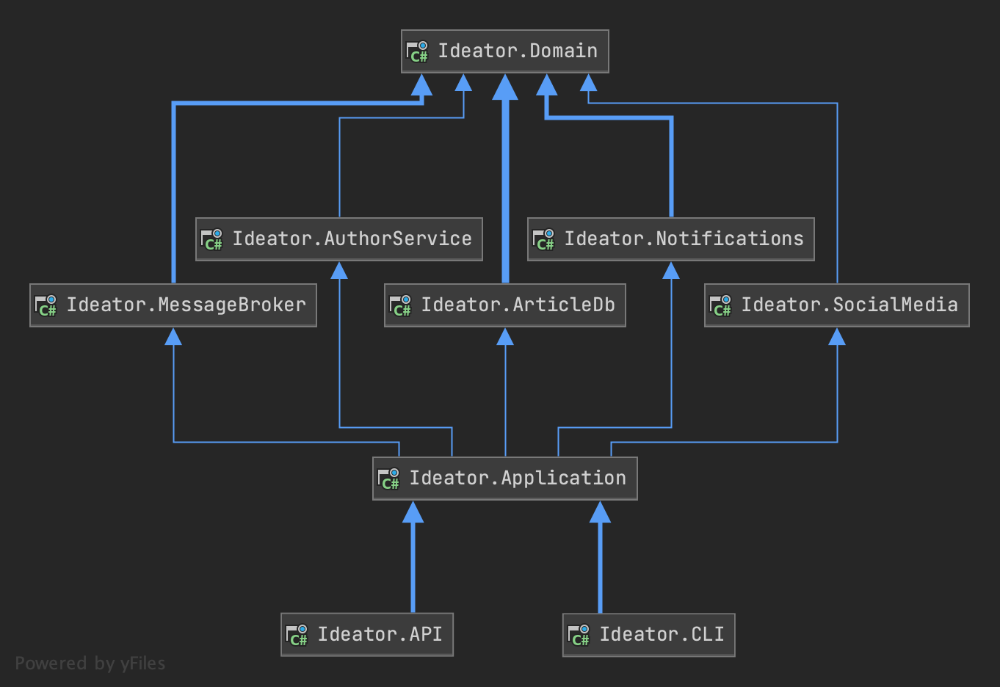

# hexagonal-dotnet

> **A production-ready reference implementation of Hexagonal Architecture (Ports & Adapters) in .NET, demonstrating clean separation between domain, application, and infrastructure layers.**

<!-- Badges: Row 1 — Identity -->
[](https://github.com/Atypical-Consulting/hexagonal-dotnet)
[](LICENSE)
[](https://dotnet.microsoft.com/)
[](https://github.com/Atypical-Consulting/hexagonal-dotnet)
[](https://github.com/Atypical-Consulting/hexagonal-dotnet)

<!-- Badges: Row 2 — Activity -->
[](https://github.com/Atypical-Consulting/hexagonal-dotnet/releases/)
[](https://github.com/Atypical-Consulting/hexagonal-dotnet/issues)
[](https://github.com/Atypical-Consulting/hexagonal-dotnet/pulls)
[](https://github.com/Atypical-Consulting/hexagonal-dotnet/commits/main)

---



## Table of Contents

- [The Problem](#the-problem)
- [The Solution](#the-solution)
- [Features](#features)
- [Tech Stack](#tech-stack)
- [Getting Started](#getting-started)
- [Usage](#usage)
- [Architecture](#architecture)
- [Project Structure](#project-structure)
- [Roadmap](#roadmap)
- [Contributing](#contributing)
- [License](#license)
- [Acknowledgments](#acknowledgments)

## The Problem

Hexagonal architecture (ports & adapters) is well-documented in theory but hard to implement cleanly in .NET. Most examples are oversimplified or tightly coupled to specific frameworks, leaving developers without a clear blueprint for structuring real-world applications with proper layer separation.

## The Solution

**hexagonal-dotnet** provides a hands-on reference implementation showing how to structure a .NET application with clean separation between domain, application, and infrastructure layers. It uses an "Ideator" article management system as the example domain, demonstrating how ports define contracts in the domain while adapters implement them in infrastructure.

```csharp
// Domain defines the port (interface)
public interface IArticleRepository : IRepository<ArticleId, Article>
{
    Article Insert(AuthorId authorId, Title title, Content content);
}

// Infrastructure provides the adapter (implementation)
public class ArticleRepository : IArticleRepository
{
    // EF Core implementation wired via dependency injection
}
```

## Features

- [x] Clean domain layer with no infrastructure dependencies
- [x] Port interfaces for repository, messaging, notifications, and social media
- [x] Multiple adapter implementations (EF Core, external services, message broker, notifications, Twitter)
- [x] Two application entry points (CLI and Web API) sharing the same hexagon
- [x] Strongly-typed Value Objects using C# records (`ArticleId`, `Title`, `Content`, `Money`, `Address`)
- [x] Dependency injection configuration wiring ports to adapters
- [x] Swagger/OpenAPI documentation via Swashbuckle
- [ ] Unit and integration tests *(planned)*
- [ ] Docker support *(planned)*

## Tech Stack

| Layer | Technology |
|-------|-----------|
| Domain | .NET 5, C# records |
| Application | ASP.NET Core 5 Web API, Console app |
| Persistence | Entity Framework Core (In-Memory) |
| API Docs | Swashbuckle / Swagger |
| Build | .NET SDK, MSBuild |

## Getting Started

### Prerequisites

- [.NET 5 SDK](https://dotnet.microsoft.com/download/dotnet/5.0) or later

### Installation

```bash
git clone https://github.com/Atypical-Consulting/hexagonal-dotnet.git
cd hexagonal-dotnet
dotnet restore
dotnet build
```

### Running the Web API

```bash
dotnet run --project src/Application.WebAPI
```

The API will be available at `https://localhost:5001` with Swagger UI at `/swagger`.

### Running the CLI

```bash
dotnet run --project src/Application.CLI
```

## Usage

### Creating an Article via the Web API

The `ArticleController` exposes endpoints to create and retrieve articles:

```csharp
// POST /api/article — Create a new article
var request = new CreateArticleRequest(
    new Title("My Article"),
    new Content("Article content here"),
    new AuthorId(Guid.NewGuid())
);

// GET /api/article/{id} — Retrieve an article
var article = await client.GetAsync($"/api/article/{articleId}");
```

### How the Layers Connect

1. **Controller** receives the HTTP request and calls the `ArticleFacade`
2. **ArticleFacade** (application layer) delegates to `ArticleService` in the domain
3. **ArticleService** uses port interfaces (`IArticleRepository`, `ArticlePublisher`) to perform business logic
4. **Adapters** (ArticleDb, MessageBroker, Notifications, SocialMedia) provide the actual implementations

## Architecture


The project follows the Hexagonal Architecture pattern (also known as Ports & Adapters):

- **Domain (Hexagon)** — Contains business logic, models, and port interfaces. Has zero dependencies on infrastructure.
- **Application** — Orchestrates use cases via facades. Depends only on the domain.
- **Infrastructure (Adapters)** — Implements port interfaces with concrete technologies (database, messaging, notifications, social media).
- **Entry Points** — CLI and Web API applications that bootstrap dependency injection and expose the system to the outside world.

### 2 Applications

- **CLI** (`Application.CLI`) — Console application for direct interaction
- **Web API** (`Application.WebAPI`) — RESTful API with Swagger documentation

### 1 Hexagon

- **Domain** — Pure business logic with ports defining contracts

### 5 Adapters

- **ArticleDb** — EF Core persistence with in-memory database
- **AuthorService** — External service client for author data
- **MessageBroker** — Message publishing for article events
- **Notifications** — Email and SMS notifications for authors
- **SocialMedia** — Twitter integration for article publishing

## Project Structure

```
hexagonal-dotnet/
├── src/
│   ├── Domain/                        # Core business logic (the hexagon)
│   │   ├── Common/                    # Base classes (IRepository, ValueObject)
│   │   ├── Model/                     # Domain entities (Article, Author, Value Objects)
│   │   └── Ports/                     # Port interfaces and domain services
│   ├── Application/                   # Use case orchestration (ArticleFacade)
│   ├── Application.CLI/              # Console entry point
│   ├── Application.WebAPI/           # Web API entry point (controllers, Swagger)
│   ├── Infrastructure.ArticleDb/     # EF Core adapter (repositories, context)
│   ├── Infrastructure.AuthorService/ # External author service adapter
│   ├── Infrastructure.MessageBroker/ # Message broker adapter
│   ├── Infrastructure.Notifications/ # Email/SMS notification adapter
│   └── Infrastructure.SocialMedia/   # Twitter adapter
├── Ideator.sln                        # Solution file
├── architecture.png                   # Architecture diagram
└── LICENSE                            # MIT License
```

## Roadmap

- [ ] Upgrade to .NET 8+ with latest C# features
- [ ] Add unit tests for domain logic and integration tests for adapters
- [ ] Add Docker Compose setup for local development
- [ ] Implement real database adapter (PostgreSQL/SQL Server)
- [ ] Add authentication and authorization
- [ ] Add CI/CD pipeline with GitHub Actions

> Want to contribute? Pick any roadmap item and open a PR!

## Contributing

Contributions are welcome! Here's how to get started:

1. Fork the repository
2. Create your feature branch (`git checkout -b feature/amazing-feature`)
3. Commit using [conventional commits](https://www.conventionalcommits.org/) (`git commit -m 'feat: add amazing feature'`)
4. Push to the branch (`git push origin feature/amazing-feature`)
5. Open a Pull Request

## License

[MIT](LICENSE) © 2021 [Atypical Consulting](https://atypical.garry-ai.cloud)

## Acknowledgments

- [Hexagonal Architecture by Example (Allegro Tech)](https://blog.allegro.tech/2020/05/hexagonal-architecture-by-example.html) — Primary inspiration
- [Clean Architecture Manga](https://github.com/ivanpaulovich/clean-architecture-manga) — .NET clean architecture reference
- [Enterprise Craftsmanship — Value Objects](https://enterprisecraftsmanship.com/posts/value-object-better-implementation/) — Value Object patterns
- [Playing with My Record Collection](https://www.romanx.co.uk/posts/playing-with-my-record-collection) — C# records inspiration

---

Built with care by [Atypical Consulting](https://atypical.garry-ai.cloud) — opinionated, production-grade open source.

[](https://github.com/Atypical-Consulting/hexagonal-dotnet/graphs/contributors)
